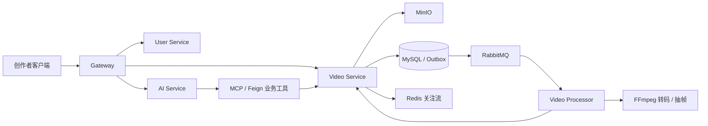

# SW 智能短视频微服务平台

SW 是一个面向创作者场景的 Java 微服务实践项目，当前主线聚焦“视频可靠异步处理”和“AI 创作者运营助手”。项目使用 Java 21、Spring Boot、Spring Cloud、RabbitMQ、Redis、MySQL、MinIO 与 Spring AI。

> 当前仓库处于持续重构阶段。README 只描述已经验证的能力和明确的开发目标，不使用尚未复现的性能数据。

## 核心业务链路



目标闭环：

```text
创作者上传视频
  -> Outbox 可靠投递处理任务
  -> Processor 转码、抽帧、重试并回写状态
  -> 审核通过后发布到关注流
  -> AI 助手查询进度、诊断失败并给出运营建议
```

## 当前状态

已经验证：

- 完成项目目录、Java 包名和 Maven 坐标统一，当前根包为 `com.jiake.jk`。
- 核心模块已在 Java 21 下编译通过。
- Docker 本地基础环境可运行：MySQL、Redis、RabbitMQ、MinIO、Nacos。
- Gateway、User、Video、Video Processor 可通过 IDEA 连接本地中间件运行。
- 已跑通预签名上传、MinIO PUT、创建视频、写入 Outbox、发送 RabbitMQ 消息和 Processor 消费。

正在重构：

- 视频处理状态机，禁止上传后直接进入已发布状态。
- Outbox 补偿、发布确认、指数退避、死信队列和人工重放。
- 消费幂等、真实 FFmpeg 转码/封面抽帧与处理结果回写。
- AI 助手对真实视频服务的工具调用、规则 RAG、权限校验和失败降级。

尚未作为完成能力对外描述：

- Processor 当前消费逻辑仍需替换为完整的视频处理流水线。
- Product、Order、Live、Chat、Admin 等存量模块不属于当前简历主线。
- 所有性能结论需要在固定环境中重新压测后才能写入简历。

## 重点改造

### 1. 可靠视频异步处理

- 视频业务状态、处理任务状态、Outbox 状态分离。
- RabbitMQ Publisher Confirm/Return、Outbox 定时补偿、重试和死信。
- 以业务幂等键、唯一约束和合法状态迁移处理重复消息。
- FFmpeg 转码、封面抽帧、结果回写以及 MinIO/MQ/FFmpeg 故障恢复。

### 2. AI 创作者运营助手

- Spring AI Tool Calling 与 SSE 流式响应。
- 查询视频处理进度、诊断失败原因、查询作品数据。
- 平台规则 RAG、标题/标签/简介生成、人工工单创建。
- 用户权限校验、模型超时降级、TraceId 与固定问题集评测。

### 3. 可验证的工程能力

- 状态机单测与 MySQL、Redis、RabbitMQ、MinIO 集成测试。
- 完整 E2E 脚本以及重复消息、服务不可用等故障演练。
- Actuator、Micrometer、Prometheus/Grafana 指标和链路追踪。
- 可复现压测报告：固定硬件、数据规模、脚本、P50/P95/P99、吞吐量与错误率。

每条简历亮点都需要对应代码、测试、指标、故障案例、架构图和演示步骤。

## 核心模块

| 模块 | 当前定位 |
|---|---|
| `gateway` | 统一入口、鉴权、路由与后续限流 |
| `user` | 用户身份、资料和关注关系 |
| `video` | 上传任务、视频状态、Outbox、发布与关注流 |
| `video-processor` | RabbitMQ 消费、FFmpeg 处理、重试与结果回写 |
| `ai` | 对话编排、RAG、记忆和流式响应 |
| `mcp-server` | AI 调用真实业务能力的内部工具适配层 |
| `common` | 统一响应、异常、鉴权上下文和基础组件 |

其他模块保留为后续扩展，不作为当前核心完成度依据。

## 本地运行

### 环境要求

- JDK 21
- Maven 3.9+
- Docker Desktop

### 启动基础设施

先从示例文件创建仅供本机使用的配置，并修改其中的密码：

```powershell
Copy-Item .env.example .env
```

真实 `.env` 已被 Git 忽略，不得提交到仓库。

```powershell
docker compose up -d mysql redis rabbitmq minio nacos
```

### 导入 Nacos 配置

```powershell
.\scripts\import-nacos-config.ps1
```

默认将 `.file/config` 中的配置导入 `dev` 命名空间。外部服务密钥均通过环境变量注入，不应提交个人密钥。

### 构建

```powershell
mvn -DskipTests install
```

### 本机服务启动顺序

1. `com.jiake.jk.user.UserApplication`
2. `com.jiake.jk.video.VideoApplication`
3. `com.jiake.jk.videoprocessor.VideoProcessorApplication`
4. `com.jiake.jk.gateway.GatewayApplication`

本地开发时只用 Docker 运行中间件，Java 服务由 IDEA 启动，避免端口冲突。

## 近期里程碑

- 2026-08-23：视频可靠异步处理 v1 与 E2E 演示。
- 2026-09-07：AI 运营助手、服务边界和链路追踪。
- 2026-09-16：测试、监控、故障演练、压测与 CI 收口。
- 2026-10-07：双项目作品集与面试材料阶段性收口；之后继续迭代。

## 项目说明

本项目参考[原项目](https://github.com/Yi-Xuan-i/YH)进行重构与扩展。
