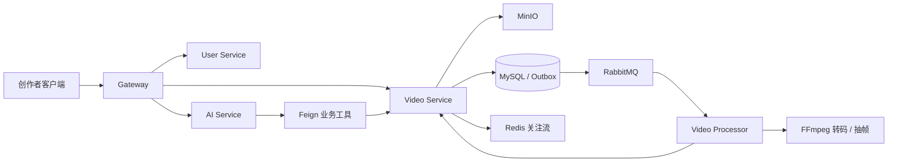

# SW 智能短视频微服务平台

SW 是一个面向创作者与内容消费者场景的 Java 微服务实践项目，当前主线聚焦“视频可靠异步处理、内容消费互动和 AI 创作者运营助手”。项目使用 Java 21、Spring Boot、Spring Cloud、RabbitMQ、Redis、MySQL、MinIO 与 Spring AI。

> 当前仓库处于持续重构阶段。README 只描述已经验证的能力和明确的开发目标，不使用尚未复现的性能数据。

## 核心业务链路



目标闭环：

```text
创作者上传视频
  -> Outbox 可靠投递处理任务
  -> Processor 转码、抽帧、重试并回写状态
  -> 审核通过后发布到关注流
  -> AI 助手查询进度、诊断失败并给出运营建议
```

## 当前状态

已经验证：

- 完成项目目录、Java 包名和 Maven 坐标统一，当前根包为 `com.jiake.jk`。
- 核心模块已在 Java 21 下编译通过。
- Docker 本地基础环境可运行：MySQL、Redis、RabbitMQ、MinIO、Nacos。
- Gateway、User、Video、Video Processor 可通过 IDEA 连接本地中间件运行。
- 已跑通真实本地视频链路：预签名上传、MinIO PUT、创建视频、Outbox、RabbitMQ、Processor、FFmpeg 转码/抽帧、处理结果回写与关注流发布。
- AI 创作者助手已完成 SSE 流式响应和两个权限受控的只读工具：视频处理状态查询、失败诊断；真实调用可携带 TraceId 追踪到 Video Service。
- 已完成公开时间 Feed、关注 Feed、点赞、收藏、评论与关注/取关接口；互动操作经 Gateway 使用隔离账号真实验收。点赞/收藏事件以 `eventId` 消费去重，评论计数通过 Outbox 异步聚合。
- 独立本地前端 `SW-web` 已通过 Vite 代理和 Gateway JWT 完成公共流、登录、作品工作台及一次真实上传到 `PUBLISHED` 的联调；本轮浏览器走查已展示真实公开 Feed、游标加载与互动入口。该前端暂不纳入本仓库。
- 固定开发机上完成 1 次预热和 5 次串行端到端样本，上传提交至 `PUBLISHED / SUCCEEDED / Outbox SUCCESS` 的 P50 为 3500 ms、P95 为 3506 ms；它仅是同机回归基线，非生产吞吐结论。

后续工程化工作：

- 将已有真实链路沉淀为自动化集成测试、可复现故障演练与前后端联调脚本。
- 继续积累固定环境下的基线和故障样本，并与后续改动进行对比。
- 仅在真实运营需求明确后，再评估规则 RAG 或更多只读工具；当前不把 MCP、复杂记忆或多 Agent 作为已完成能力。

尚未作为完成能力对外描述：

- Product、Order、Live、Chat、Admin 等存量模块不属于当前简历主线。
- 不把该固定环境基线表述为生产 TPS、并发上限或通用性能结论。

## 重点改造

### 1. 可靠视频异步处理

- 视频业务状态、处理任务状态、Outbox 状态分离。
- RabbitMQ Publisher Confirm/Return、Outbox 定时补偿、重试和死信。
- 以业务幂等键、唯一约束和合法状态迁移处理重复消息。
- FFmpeg 转码、封面抽帧、结果回写以及 MinIO/MQ/FFmpeg 故障恢复。

### 2. AI 创作者运营助手

- Spring AI Tool Calling 与 SSE 流式响应。
- 查询视频处理进度、基于服务端失败摘要诊断失败原因；均受当前创作者身份约束。
- 标题/标签/简介等创作建议只生成文本，不自动修改视频或执行写操作。
- 用户权限二次校验、模型超时降级、TraceId 与工具调用审计。

### 3. 内容消费与社交互动

- 公开时间 Feed 与关注 Feed 均使用游标分页，避免深分页；视频发布后通过独立 Inbox 向关注者扇出。
- 点赞、收藏使用 Redis 原子状态切换；消息携带全局 `eventId`，消费端以幂等表去重，避免重投重复累加互动数。
- 评论在本地事务中写入 Outbox，再由消费者异步聚合视频/根评论计数；互动计数是最终一致语义，不在前端伪造同步强一致。
- 关注关系只维护 User 域社交图谱，互关不会隐式创建聊天会话或好友记录，避免内容社交依赖 Chat 领域。

### 4. 可验证的工程能力

- 状态机单测与 MySQL、Redis、RabbitMQ、MinIO 集成测试。
- 完整 E2E 脚本以及重复消息、服务不可用等故障演练。
- Actuator、Micrometer、Prometheus/Grafana 指标和链路追踪。
- GitHub Actions 核心回归：Gateway 安全与限流、视频 Outbox/状态机/消费、AI 工具权限与诊断规则。
- 可复现压测报告：固定硬件、数据规模、脚本、P50/P95/P99、吞吐量与错误率。

每条简历亮点都需要对应代码、测试、指标、故障案例、架构图和演示步骤。

可直接按 [演示 Runbook](docs/DEMO_RUNBOOK.md) 在本机复现“成功上传、失败诊断、死信恢复、指标查看”四段证据链。

可按 [简历项目说明](docs/SW-简历项目说明.md) 查看已验证的技术边界、量化口径和面试可追问事实。

## 核心模块

| 模块 | 当前定位 |
|---|---|
| `gateway` | 统一入口、鉴权、路由与后续限流 |
| `user` | 用户身份、资料和关注关系 |
| `video` | 上传任务、视频状态、Outbox、发布与关注流 |
| `video-processor` | RabbitMQ 消费、FFmpeg 处理、重试与结果回写 |
| `ai` | SSE 对话编排、受权限约束的状态查询与失败诊断 |
| `mcp-server` | 预留的工具适配模块，不属于当前完成能力 |
| `common` | 统一响应、异常、鉴权上下文和基础组件 |

其他模块保留为后续扩展，不作为当前核心完成度依据。

## 本地运行

### 环境要求

- JDK 21
- Maven 3.9+
- Docker Desktop

### 启动基础设施

先从示例文件创建仅供本机使用的配置，并修改其中的密码：

```powershell
Copy-Item .env.example .env
```

真实 `.env` 已被 Git 忽略，不得提交到仓库。

```powershell
docker compose up -d mysql redis rabbitmq minio nacos
```

### 导入 Nacos 配置

```powershell
.\scripts\import-nacos-config.ps1
```

默认将 `.file/config` 中的配置导入 `dev` 命名空间。外部服务密钥均通过环境变量注入，不应提交个人密钥。

### 构建

```powershell
mvn -DskipTests install
```

### 核心回归

公开仓库的 GitHub Actions 使用 JDK 21 自动执行下列主线回归，不依赖个人密钥或 Docker 中间件：

```powershell
mvn -B -ntp "-Dsurefire.failIfNoSpecifiedTests=false" "-Dtest=InternalRouteBlockFilterTest,GatewayRateLimitServiceTest,VideoServiceImplTest,OutboxMessagePublisherTest,VideoProcessingTaskServiceImplTest,VideoPublishedInboxConsumerTest,FollowFeedDeadLetterPreparationServiceTest,FollowFeedDeadLetterRecoveryServiceTest,FollowFeedServiceImplTest,VideoConsumerTest,CreatorAssistantServiceImplTest,VideoProcessingToolsTest" -pl gateway,video/video-core,video-processor,ai -am test
```

### 本机服务启动顺序

1. `com.jiake.jk.user.UserApplication`
2. `com.jiake.jk.video.VideoApplication`
3. `com.jiake.jk.videoprocessor.VideoProcessorApplication`
4. `com.jiake.jk.gateway.GatewayApplication`

真实视频异步链路验收（本地开发环境）：先启动上述服务与 Docker 基础中间件，再执行：

```powershell
.\scripts\verify-video-e2e.ps1
```

脚本会生成临时 2 秒 MP4，验证预签名上传、Outbox、RabbitMQ、FFmpeg 转码与抽帧、MinIO 落盘及状态回写；只写入本地开发数据。

失败链路验收（本地开发环境）：

```powershell
.\scripts\verify-video-failure-e2e.ps1
```

脚本会上传一个扩展名合法、内容故意无效的隔离测试文件，真实验证 FFmpeg 异常如何回写为 `REJECTED / FAILED / SUCCESS`，并可用于核对 Prometheus 指标与创作助手的失败诊断；不会修改已有视频数据。

消息死信队列配置首次启用时：先停止 Video Service 与 Video Processor，确认 `video.review.queue` 没有积压后执行 `./scripts/refresh-video-review-queue.ps1`，再启动两个服务。脚本拒绝删除有积压的队列。

租约恢复故障演练（仅本地）：在 Video Processor 的 IDEA 运行参数中临时增加下列参数，会在转码完成、调用 Video Service 回写前暂停 15 秒。此时停止 Video Service，可稳定验证消息进入死信队列、处理租约到期后由 Outbox 补偿并重新完成处理；正常运行不要配置这两个参数。

```text
--sw.video-processing.fault-injection.enabled=true
--sw.video-processing.fault-injection.before-complete-callback-delay-ms=15000
```

默认处理租约为 600 秒。为缩短**仅本地**演练等待，可在 Video Service 临时增加 `--sw.video-processing.lease-seconds=20 --sw.video-processing.recovery-delay-ms=3000`；演练结束必须移除这些参数并恢复默认租约。

DLQ 运维入口（仅服务内网调用，当前不经 Gateway 暴露）：

```text
GET  /video/api/private/processing/operations/overview
POST /video/api/private/processing/{videoId}/recover-expired
```

概览接口返回主队列/DLQ 消息数、处理中任务数和失败任务数。人工恢复接口只接受“租约已过期且仍为 `PROCESSING`”的视频任务；它会创建新的 Outbox 补偿消息，不会直接重放 DLQ 中的旧消息。

视频发布后的关注流扇出使用独立 Inbox 队列。User Service 等下游短暂不可用时，消息会携带尝试次数进入 `video.publish.inbox.retry.queue`，在 Broker 持久化等待 5 秒后回流主队列；第 3 次仍失败才进入 `video.publish.inbox.dead.queue`。该策略避免消费者高频重试，也不会影响视频已发布的主状态机。

最终 DLQ 仅允许内网运维人工恢复：

```text
POST /video/api/private/follow-feed/operations/recover-dead?batchSize=10
```

恢复操作先按原消息摘要创建审计记录和新的 PENDING Outbox，数据库事务成功后才 ACK 原 DLQ 消息；不会把旧消息直接 requeue。若应用在提交后 ACK 前中断，下一次操作会复用仍在投递中的 Outbox；若前一次 Outbox 已结束而消息因下游业务规则仍回到 DLQ，则生成带递增尝试号的新审计记录。`video_feed_inbox` 的 `(recipient_id, video_id)` 唯一约束兜底业务幂等。该接口受 Gateway 的 `/api/private/**` 阻断，只应从受限运维网络直连调用。

固定环境的端到端延迟基线（串行、1 次预热 + 5 次测量）可使用：

```powershell
.\scripts\measure-video-e2e.ps1
```

该脚本从预签名请求开始，到视频达到 `PUBLISHED / SUCCEEDED / Outbox SUCCESS` 停止计时，排除本地生成测试媒体的时间，并输出最小值、P50、P95、最大值及每条 TraceId。它只用于同一台机器、相同 Docker/服务配置下的回归对比，不能据此宣称生产吞吐或通用 TPS。

### 链路排障

所有 Servlet 请求会读取或生成 `X-Trace-Id`，并在响应头回传；Feign 调用自动透传该请求头。视频发布消息会把 TraceId 写入 Outbox 消息体，Processor 消费时恢复同一 TraceId 后再调用 Video Service。因此可使用响应头中的 TraceId 串联上传提交、Outbox、Processor 和处理结果回写日志。

### 指标与健康检查

Video Service、Video Processor 与 AI Service 已引入 Actuator 和 Prometheus registry。导入最新 `common-dev.yaml` 并重启对应服务后，可访问：

```text
GET /video/api/actuator/health
GET /video/api/actuator/prometheus
GET /video-processor/api/actuator/health
GET /video-processor/api/actuator/prometheus
GET /ai/api/actuator/health
GET /ai/api/actuator/prometheus
```

业务指标包括 `sw_outbox_delivery_seconds`、`sw_outbox_delivery_failures_total`、`sw_video_transcoding_seconds`、`sw_video_transcoding_failures_total`、`sw_video_publish_inbox_retry_total`、`sw_video_publish_inbox_dead_letter_total`、`sw_video_publish_inbox_dead_letter_recovery_total` 和 `sw_ai_creator_assistant_tool_invocations_total`。AI 工具指标仅按工具名计数，不附带创作者、视频、提示词或模型回复。日志默认带有 `[traceId]`，可与上述指标及业务日志联合排障。Prometheus 抓取配置与 Grafana 看板已版本化；现场采样和故障演练以 Prometheus Targets 全部按实际运行状态确认后记录。

本机启动可观测组件：

```powershell
docker compose --profile observability up -d prometheus grafana
```

Prometheus 位于 `http://localhost:9090`，Grafana 位于 `http://localhost:3000`。两者仅绑定本机回环地址；Grafana 默认本机登录为 `admin/admin`，首次使用后应在 `.env` 设置 `GRAFANA_ADMIN_USER` 和 `GRAFANA_ADMIN_PASSWORD` 后重启 Grafana。预置看板为“SW / SW 核心链路可观测性”，包含网关限流拒绝、Outbox 投递失败、转码 P95 耗时和转码失败次数。Prometheus 会从 Docker 容器访问 IDEA 本机服务，因此需先启动 Gateway、Video、Video Processor；若要查看创作助手工具指标，还需启动 AI Service。

本地开发时只用 Docker 运行中间件，Java 服务由 IDEA 启动，避免端口冲突。

## 近期里程碑

- 2026-08-23：视频可靠异步处理 v1、E2E 演示与 Prometheus/Grafana 现场证据。
- 2026-09-07：AI 创作者助手、服务边界、TraceId 与前后端联调演示。
- 2026-09-16：测试、监控、故障演练、压测与 CI 远端验收收口。
- 2026-10-07：双项目作品集与面试材料阶段性收口；之后继续迭代。

## 项目说明

本项目参考[原项目](https://github.com/Yi-Xuan-i/YH)进行重构与扩展。
