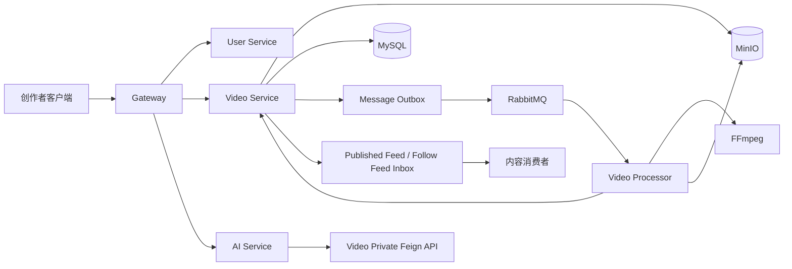

# SW 短视频微服务平台：面试架构理解文档

## 1. 一句话介绍

SW 是我在开源原项目基础上、经作者允许后重构和扩展的短视频微服务平台。我把重点放在“创作者可靠发布到消费者互动”的闭环：视频通过对象存储直传，业务提交后由 Outbox 和 RabbitMQ 驱动异步转码、抽帧和状态回写；发布后通过关注 Feed 让消费者刷流和互动，并用 Spring AI 提供权限受控的创作者状态查询和失败诊断。

## 2. 面试时先讲业务闭环



推荐讲解顺序：

1. 用户注册登录后通过 Gateway 访问 User 和 Video。
2. 上传阶段由 Video Service 生成 MinIO 预签名 URL，客户端直接上传媒体，避免大文件经过业务服务。
3. 提交视频时，视频状态、处理任务和 Outbox 在同一个 MySQL 事务中落库。
4. Outbox Publisher 发送 RabbitMQ；Processor 抢占任务、调用 FFmpeg 转码和抽帧，产物写回 MinIO。
5. Processor 通过 Video 私有 Feign 接口回写处理结果，Video Service 在条件状态迁移成功后把视频置为 `PUBLISHED`。
6. 发布事件继续经过 Outbox，关注流消费者按粉丝分页写入 `video_feed_inbox`；公开 Feed 和关注 Feed 使用游标分页。
7. 点赞、收藏和评论采用快速响应与异步计数分离，消费端使用事件幂等或评论幂等表避免重复累加。
8. AI 助手只对当前创作者可访问的视频调用只读工具，不代替业务服务写数据。

## 3. 模块和职责

| 模块 | 主要职责 | 面试定位 |
| --- | --- | --- |
| `parent` | 统一 Java、Spring Cloud、MyBatis Plus、Spring AI 等版本 | 工程基础 |
| `common` | `Result`、异常、JWT、用户上下文、TraceId、Redisson、MinIO/S3、动态线程池等 | 公共能力 |
| `gateway` | Nacos 路由、JWT 鉴权、私有路径阻断、限流、WebSocket 握手 | 入口安全和流量治理 |
| `user` | 用户、登录、资料、关注关系、粉丝分页和内部 Feign 接口 | 身份与社交图谱 |
| `video` | 视频、上传、处理任务、Outbox、Feed、互动、评论、标签 | 业务主服务 |
| `video-processor` | MQ 消费、FFmpeg、MinIO 产物处理、互动批处理 | 异步计算服务 |
| `ai` | WebFlux、SSE、Spring AI、创作者工具、R2DBC/Redis 会话 | 受控 AI 能力 |
| `mcp-server` | MCP Tool Provider、Milvus 向量记忆/商城检索等扩展 | 后续 AI/MCP 方向 |

> 重构时已主动移除与短视频主线无依赖的商城、订单、直播、聊天和后台管理模块，并清理 Gateway 路由与本地 Nacos 配置。这样仓库边界与简历叙事一致：保留下来的代码都能对应可靠发布、内容消费或受控 AI 能力。

服务内部大多按 `controller -> service -> mapper` 分层；跨服务通过 `*-feign` 和 `*-pojo` 共享明确 DTO，公开接口与 `/private` 内部接口分开。

## 4. 上传和异步处理主链路

### 4.1 为什么不让接口同步完成上传和发布

上传成功只代表对象存储收到文件，不代表文件一定能被 FFmpeg 解码、转码和抽帧。同步链路会长时间占用 HTTP 线程，并且很难处理 MQ、FFmpeg、MinIO 或回写服务的故障。因此把“提交”和“处理完成”分离：提交只创建任务，处理成功才发布。

### 4.2 代码对应的状态

视频状态在 `Video` 中维护：

```text
DRAFT -> PENDING_REVIEW -> PROCESSING -> PUBLISHED
                                      \-> REJECTED
```

处理任务在 `VideoProcessingTask` 中独立维护：

```text
PENDING -> PROCESSING -> SUCCEEDED
                     \-> FAILED
```

Outbox 状态也独立维护：

```text
PENDING -> SENDING -> SUCCESS
                  \-> FAILED -> DEAD
```

三类状态分离的好处是：媒体业务状态、异步处理状态和消息投递状态可以分别排障，不能用“消息发送成功”冒充“视频处理成功”。

### 4.3 关键步骤

1. `presignPutObject` 或分片上传接口创建上传任务并返回预签名地址。
2. 客户端直传 MinIO；分片场景由服务端完成合并。
3. `postVideoEnd` 创建 `DRAFT` 视频。
4. `postVideoMessage` 使用条件更新防止重复提交，将视频变为 `PENDING_REVIEW`，创建 `VideoProcessingTask(PENDING)` 和 `MessageOutbox(PENDING)`。
5. 事务提交后立即尝试投递；如果提交后进程宕机，定时扫描仍会发现 PENDING/FAILED Outbox。
6. Processor 消费消息时先调用 `claimVideoProcessing`，用 `status = PENDING` 条件更新抢占任务；抢占失败说明重复消息或任务已被其他消费者处理。
7. FFmpeg 下载源文件、转码、抽取封面，生成新的对象 key 并上传 MinIO。
8. 成功回写时，先将任务置为 `SUCCEEDED`，再将视频从 `PROCESSING` 条件更新为 `PUBLISHED`，并创建发布关注流 Outbox。
9. 转码失败保存截断后的错误摘要，任务置为 `FAILED`，视频置为 `REJECTED`。

### 4.4 Outbox 如何解决双写问题

业务数据和待投递消息在同一个本地事务中提交，避免“数据库提交了但 MQ 没消息”。事务提交后可以立即发送，但立即发送失败不影响已提交业务；`OutboxMessagePublisher` 会扫描 `PENDING`/`FAILED` 记录，原子抢占为 `SENDING` 后发送，并通过 RabbitMQ Publisher Confirm/Return 更新状态。

这里的语义不是 exactly-once，而是：

```text
至少一次投递 + 生产端可重试 + 消费端幂等 + 数据库条件状态迁移
```

当前投递器默认最多重试 5 次，退避时间随次数增长，超过上限进入 `DEAD`。

## 5. 处理回写失败和租约恢复

Processor 在任务抢占时写入 `leaseExpireAt`。如果 FFmpeg 已完成但 Video Service 暂时不可用，Processor 不把消息当作成功消费，而是让消息进入重试/死信路径；数据库中的任务仍是 `PROCESSING`，直到租约过期。

Video Service 的定时恢复任务查找“仍为 PROCESSING 且租约已过期”的任务，然后条件更新：

```text
PROCESSING task -> PENDING
PROCESSING video -> PENDING_REVIEW
创建新的处理 Outbox -> 重新投递
```

这样做比直接把旧消息无限 requeue 更可控：数据库任务状态是恢复依据，恢复动作可审计，且可以避免多个消费者同时重复处理。面试时要强调“租约是处理拥有权的超时边界”，不是锁的永久替代品。

## 6. 发布关注流和死信恢复

### 6.1 Feed 模型

- 公开时间 Feed：直接按 `publishedAt + videoId` 游标读取，避免深分页 `OFFSET`。
- 关注 Feed：发布事件由 Video Service 消费，调用 User Service 分页获取粉丝，每批最多 500 个，写入 `video_feed_inbox`。
- 读取关注 Feed：按 `publishedAt + feedId` 游标读取 Inbox，再批量补充创作者信息和访问 URL。
- Inbox 使用 `(recipient_id, video_id)` 唯一约束或 `insert ignore` 兜底重复事件。

### 6.2 下游不可用时的处理

发布主状态机不因为 User Service 暂时不可用而回滚；关注流是发布后的下游副作用。`VideoPublishedInboxConsumer` 失败时把消息送入带 TTL 的延迟队列，最多尝试 3 次，最终进入 `video.publish.inbox.dead.queue`。

人工恢复不是直接把旧 DLQ 消息 requeue：

1. 读取 DLQ 消息并计算消息摘要。
2. 在事务中创建恢复审计记录和新的 PENDING Outbox。
3. 数据库提交成功后 ACK 原 DLQ 消息。
4. 新 Outbox 由统一投递器发送；重复恢复由摘要、恢复次数和 Inbox 唯一键共同保护。

这个设计把“消息是否还在队列”和“恢复意图是否已经持久化”分开，避免 ACK 后恢复意图丢失。

## 7. 点赞、收藏、评论和一致性

### 点赞/收藏

用户操作先在 Redis 中通过 Lua 做原子状态切换；缓存未命中时在用户-视频粒度 Redisson 锁内回源 MySQL，再把目标状态回填。状态真正发生变化后生成全局 `eventId` 并发送 MQ，Video Service 消费端先把 eventId 写入消费幂等表，插入成功才累计视频的点赞/收藏数。

因此接口可以低延迟返回，聚合数字是最终一致。重复消息不会重复累加，取消操作用 `-1` 增量。当前这条互动事件发送路径还可以继续统一到 Outbox，这是后续增强目标。

### 评论

评论正文和根评论关系先在本地事务中落库，同时写入评论可靠 Outbox。消费者以 `comment_id` 写入 `video_comment_event_consumption`，重复消息直接跳过，然后批量更新视频评论数和根评论回复数。

## 8. Gateway、认证和可观测性

### Gateway

- `AuthFilter`：解析 JWT，将用户 ID 放入内部请求头；WebSocket 从握手 query 参数读取 token。
- `InternalRouteBlockFilter`：阻断经过公网 Gateway 的 `/api/private/` 路径，避免内部 Feign API 被前端直接调用。
- `RateLimitFilter`：只保护写请求和 AI 路径；基于 IP、用户、路由三个维度在一次 Redis Lua 脚本中滑动窗口判断，保证多维度要么全部扣减，要么全部拒绝。

### 公共能力

Servlet 服务通过 `TraceIdInterceptor` 读取或生成 `X-Trace-Id`，Feign 透传该请求头；视频消息体携带 TraceId，消费者恢复后再调用 Video Service。这样可以串起 HTTP、Outbox、RabbitMQ、Processor 和结果回写日志。

### 指标

当前重点指标包括：Outbox 投递耗时/失败、FFmpeg 转码耗时/失败、关注流重试/死信/恢复、Gateway 限流拒绝、AI 工具调用次数。AI 指标只带工具名等低基数标签，不记录用户、视频、提示词和模型回复。

## 9. AI 创作者助手的边界

AI Service 使用 WebFlux 和 SSE 输出流式结果，通过 Spring AI 调用 Qwen 兼容接口。创作者身份来自请求上下文，服务端放入 ToolContext 的 `creatorUserId`，模型不能通过参数指定查询用户。

当前两个核心工具：

- `query_video_processing_status`：查询当前创作者指定视频的真实处理状态。
- `diagnose_video_processing_failure`：仅对失败状态的任务，根据服务端错误摘要做有限规则匹配并给出建议。

工具只读、不发布、不删除、不修改视频；服务端失败摘要是事实来源，未匹配时明确回答原因未知。模型超时和异常会降级为 SSE 错误事件。

因此准确定位是“微服务中的受控 AI 辅助能力”，不是完整的自主 Agent 平台。`mcp-server` 已有向量记忆和商城检索工具，可作为后续把工具协议化、做 RAG 和 Python Agent 编排的扩展基础。

## 10. 当前完成度和证据

已有证据包括：

- Gateway 私有路由和限流测试。
- Video 状态机、Outbox、租约恢复、Feed、死信准备/恢复和互动消费幂等测试。
- Processor 消费和 FFmpeg 相关测试。
- AI 助手和工具权限/诊断测试。
- `verify-video-e2e.ps1`：成功上传到 `PUBLISHED / SUCCEEDED / Outbox SUCCESS`。
- `verify-video-failure-e2e.ps1`：无效媒体进入 `REJECTED / FAILED / SUCCESS`。
- `refresh-video-review-queue.ps1`、`measure-video-e2e.ps1` 和故障注入参数：用于死信、租约和回归基线演练。
- GitHub Actions `Core Regression`：Java 21 下执行网关、视频异步链路和 AI 核心回归。

当前固定开发机的串行延迟数据只能作为回归基线；面试中同时说明机器、样本、测试方式和“不代表生产吞吐”的限制。

## 11. 面向 2026 秋招的增强路线

### P0：让可靠性和安全边界更完整

- 把点赞/收藏事件统一纳入 Outbox，补充 Publisher Confirm、失败重试和运维查询。
- 为 Feign 私有接口增加服务身份认证、签名或 mTLS；Gateway 阻断继续保留，但不作为唯一安全层。
- 清理开发配置中的硬编码密钥和示例支付密钥，使用环境变量、密钥管理或本地占位配置。

### P1：让工程证据更接近生产

- 使用 Testcontainers/Compose 在 CI 启动 MySQL、Redis、RabbitMQ、MinIO，自动执行真实集成测试。
- 引入 Flyway/Liquibase 或等价迁移流程，确保 Outbox、Inbox、消费幂等表和索引可重复初始化。
- 为 FFmpeg 增加并发信号量、任务队列、单任务磁盘配额、超时取消、进程隔离和失败清理监控。

### P2：应对规模和 AI 应用深度

- 对高粉丝创作者采用分批扇出、调度限流、热点读扩散或混合 Feed 策略，增加 Inbox 清理和历史数据归档。
- 用 OpenTelemetry 统一 Reactor、Feign、RabbitMQ 的上下文传播，完善告警和 SLO。
- 为 AI 工具建立离线问题集，评估工具选择正确率、权限越权率、幻觉率和超时率；增加结构化工具结果、提示词注入防护和模型降级。
- 把 `mcp-server` 的向量记忆、商城检索和用户工具接成明确的 MCP 能力，再评估 Python Agent 的规划和工具编排，不急于引入多 Agent 复杂度。
